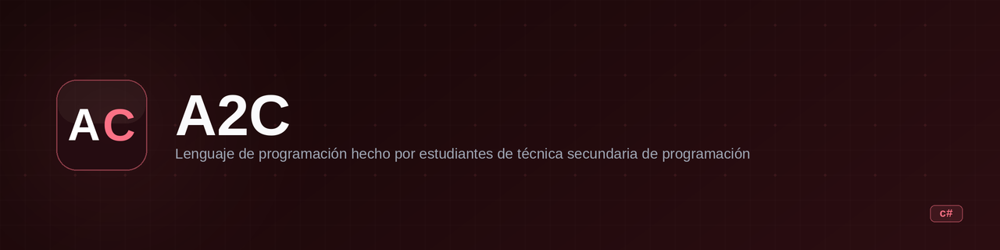

<p align="center">
  
</p>

<h1 align="center">A2C</h1>

<p align="center"><b>A Spanish-language programming language that compiles to C#, built by high school students.</b></p>

<p align="center">
  
  
  
  
</p>

---

## What it is

A2C is a custom programming language with Spanish syntax. It reads `.arb` source files, tokenizes them, parses the tokens, and generates C# code which is then compiled via CodeDOM. The language supports basic I/O, variables, conditionals, loops, and arithmetic/string operations.

**In one sentence:** A Spanish-syntax language that transpiles to C# and runs on .NET Framework 4.8.1.

## State

| | |
|---|---|
| **State** | Prototype |
| **Last activity** | 2023-11 |
| **Can it be used today** | No — Windows-only, requires .NET Framework 4.8.1, no active maintenance |
| **What's missing** | No tests, no error recovery, limited language features (no functions, no arrays, no string methods), no cross-platform support |
| **Known risks / tech debt** | Single 1270-line file, no separation of concerns, hardcoded strings, no input validation edge cases |

## Why it exists

A2C was created as a school project by programming students at a technical high school. The goal was to build a language with Spanish keywords that could be compiled to an executable. It shipped with an IDE ("Meat-Beverage") and a Windows installer.

## Installation and usage

**Requirements:** Windows, .NET Framework 4.8.1

1. Run `Instalar A2C.exe` — this installs the language runtime, dependencies, and the IDE.
2. If A2C doesn't open or closes immediately, go to the install directory (default: `C:\Program Files (x86)\A2C\`) and run `NDP481-Web` to install .NET Framework.

**Using the IDE:**
- Open `MEAT-BEVERAGE` from the install directory.

**Using the command line:**
```bash
# JIT mode — executes instructions in the console
A2C JIT mi-programa

# CMP mode — compiles to .exe
A2C CMP mi-programa

# Both — compiles and executes
A2C Ambos mi-programa

# Debug mode — checks for errors without executing
A2C Depurar mi-programa
```

**Example A2C code (`hola.arb`):**
```
Imprimir "Hola, mundo!"
Variable = Leer
Imprimir Variable + " es tu nombre"
```

**Syntax reference:**
```
Imprimir "Texto" + Variable   →  prints to console
Variable = Leer               →  reads user input (string)
Variable = {Leer}             →  reads user input (integer)
Si 1 = 2 ( Imprimir "no" )   →  conditional
```

## Stack

- **Language / runtime:** C# / .NET Framework 4.8.1
- **Dependencies:** CodeDOM (for C# compilation), FastColoredTextBox (for the IDE)
- **Platform:** Windows only
- **File extension:** `.arb`

## Architecture

The entire language is a single `Program.cs` file (1270 lines) containing:

```
Main() → args parsing → Tokenizador() → Perser() → CodeDOM compile
```

- **Tokenizador** — reads the `.arb` file character by character, produces a list of `(Valor, Tipo)` tokens
- **Perser** — walks the token list, generates C# source code as a string, and compiles it via `CSharpCodeProvider`
- **OperacionM** — handles arithmetic and string operations (recursive/infinite chaining)
- **OperacionL / FuncionSi** — handles logical comparisons and conditionals

## Repo structure

```
Program.cs            # The entire language implementation (1270 lines)
Instalar A2C.exe      # Windows installer (language + IDE + dependencies)
docs/
  overview.md         # Auto-generated overview (2026-09)
README.md             # This file
```

## Roadmap

- [ ] No active roadmap — project is in maintenance-only mode
- [ ] Add loop support (`Mientras`, `Repetir` are tokenized but not implemented in the parser)
- [ ] Add error recovery instead of `Environment.Exit(-1)` on first error
- [ ] Separate tokenizer, parser, and compiler into distinct classes

## Notes and decisions

- The language keywords are in Spanish: `Imprimir` (print), `Leer` (read), `Si` (if), `Mientras` (while), `Repetir` (repeat), `Fin` (end), `Y` (AND), `O` (OR).
- Variables are dynamically typed — no declaration needed, type is inferred from assignment.
- The compiler generates C# source code as a string and compiles it at runtime using `CSharpCodeProvider`. This is a transpiler pattern, not a native compiler.
- `Mientras` and `Repetir` are recognized by the tokenizer but have no implementation in the parser — they silently do nothing.
- The original authors state: "This project is finished. No new features will be added, but proposed changes and bug fixes will be accepted."
- No unit tests exist. The only validation is the `Depurar` (debug) mode which checks for syntax errors.

## License

Private — no license file. Not open source, just visible.
